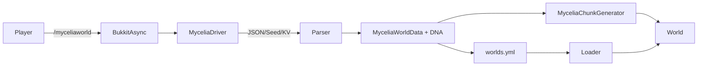

# Whitepaper: Mycelia Minecraft – Emergent Worlds aus GPU-Chaos

## 1. Executive Summary
Mycelia Minecraft koppelt ein Paper-Plugin (Java 21, API 1.21) mit einem GPU-gebundenen Treiber, der Welt-Parameter und „DNA“ in VRAM generiert. Statt statischer Seeds entstehen reproduzierbare Welten aus deterministischem Chaos, das durch OpenCL-Kernel gespeist wird. Der Ansatz richtet sich an Entwickler, die Bukkit/Paper kennen und Minecraft als Experimentierfeld für prozedurale Systeme sehen. Kernwirkung im Spiel: Welten tragen eine nachprüfbare DNA, die Terrain, Strukturen, Lore und Evolutionszustand beeinflusst – mit klaren Hooks für eigene Erweiterungen.

## 2. Problemstellung: Grenzen klassischer Seeds
Klassische Seeds sind numerische Tokens ohne semantische Weltidentität. Parametrisches Noise-Tuning liefert Reproduzierbarkeit, aber wenig Lebendigkeit und kaum Kopplung an externe Systeme. Mycelia adressiert das, indem Seeds als Hardware-gebundene, mehrdimensionale Signatur verstanden werden und damit mehr Kontext als reine Zahlen transportieren.

## 3. Mycelia Ansatz: Welt-DNA aus GPU-gebundenem Chaos
Der Treiber erzeugt deterministisches Chaos in VRAM (OpenCL 1.2+) und liefert nur abgeleitete Parameter (Seed, Block-Palette, Skala, Meeresspiegel) an das Plugin. Die eigentlichen Kernel-Zustände bleiben auf der GPU; ins Plugin gelangen ausschließlich formatierte Nutzdaten oder Fallback-Werte. Chaos dient hier als reproduzierbare Zustandsquelle, nicht als Zufall – gleiche Inputs erzeugen gleiche Outputs, werden aber kryptografisch gegen triviale Manipulationen gehärtet.

## 4. Systemarchitektur
### Komponenten
- **Paper-Plugin:** Commands, Generator, Caches, Evolution, Telemetrie.
- **Treiber (One-Shot/Persistent):** Zeilenbasierte JSON-IPC, erzeugt Weltparameter aus VRAM-Chaos.
- **OpenCL/DLL:** Kern der Mycelia-Engine (außerhalb des Plugins, genutzt vom Treiber).
- **Persistenz:** `worlds.yml` speichert DNA/Metadaten pro Welt; `config.yml` definiert Treiber- und Fallback-Defaults.

### Datenfluss (Mermaid)


## 5. Treiber & Kommunikationsmodell
- **One-Shot:** `ProcessBuilder` ruft den konfigurierten Befehl auf; STDOUT-Letzte-Zeile als Payload; Timeout pro Aufruf (`driver.timeoutSeconds`).【F:mc_mycelia/src/main/java/com/mycelia/mc/driver/MyceliaDriver.java†L68-L157】【F:mc_mycelia/src/main/java/com/mycelia/mc/driver/MyceliaDriver.java†L262-L346】
- **Persistent:** Separater Prozess mit JSON-Lines-IPC (`cmd` Felder wie `world`, `health`, `otoc_chaos`, `dream_state`, `symbolic_abstract`, `noise`). Restart-once-Logik bei fehlender Antwort, Timeout gesteuert.【F:mc_mycelia/src/main/java/com/mycelia/mc/driver/MyceliaDriverService.java†L17-L169】【F:mc_mycelia/src/main/java/com/mycelia/mc/driver/MyceliaDriverService.java†L170-L235】
- **Formate:** JSON-Objekt `{...}` (bevorzugt), Plaintext-Seeds oder `key=value`-Listen; Arrays `[ ... ]` für numerische Vektoren (Dream-State, Symbolic Abstraction). Log-Zeilen mit Prefix `[INFO]` etc. werden ignoriert.【F:mc_mycelia/src/main/java/com/mycelia/mc/driver/MyceliaDriver.java†L282-L346】【F:mc_mycelia/src/main/java/com/mycelia/mc/driver/MyceliaDriverService.java†L170-L235】
- **Warmup/Health:** Async-Warmup beim Plugin-Start; Persistent-Ping im Debug/Health-Befehl; Timeout- und Fallback-Zähler werden mitgeführt.【F:mc_mycelia/src/main/java/com/mycelia/mc/MyceliaWorldPlugin.java†L25-L83】【F:mc_mycelia/src/main/java/com/mycelia/mc/command/MyceliaCommand.java†L46-L99】
- **Fallback:** Ungültige Antworten oder Materialnamen triggern sichere Defaults (Seed aus SecureSeedFallback, Standardblöcke, Skala).【F:mc_mycelia/src/main/java/com/mycelia/mc/driver/MyceliaDriver.java†L167-L259】【F:mc_mycelia/src/main/java/com/mycelia/mc/driver/MyceliaDriver.java†L347-L400】

## 6. Weltgenerierung im Detail
- **Parameter:** `seed`, `baseBlock`, `surfaceBlock`, `oreBlock`, `scale`, `seaLevel`, Biome-Profile (Humidity/Temperature-Ranges).【F:mc_mycelia/src/main/java/com/mycelia/mc/generation/MyceliaChunkGenerator.java†L20-L74】
- **Terrain:** Simplex-Noise, vertikaler Gradient, Schwelle `finalValue > 0.5`; Wasser unter Meeresspiegel; Ore-Rauschen mit Seed-XOR `0xCAFEEBABEL` (>0.8 -> Ore).【F:mc_mycelia/src/main/java/com/mycelia/mc/generation/MyceliaChunkGenerator.java†L38-L72】【F:mc_mycelia/src/main/java/com/mycelia/mc/generation/MyceliaChunkGenerator.java†L75-L107】
- **Strukturen:** `MyceliaStructurePopulator` (≈2 %/Chunk, Varianten abhängig vom Dream-Gradient), `MyceliaUndergroundPopulator` (≈3 %/Chunk, Höhlen-Amethyst/Obsidian), Lore-Populator als Zusatz.【F:mc_mycelia/src/main/java/com/mycelia/mc/generation/MyceliaStructurePopulator.java†L17-L74】【F:mc_mycelia/src/main/java/com/mycelia/mc/generation/MyceliaChunkGenerator.java†L109-L118】
- **Determinismus:** Gleiche Treiber-Inputs -> gleiche Welt-DNA -> gleiche Terrain-/Struktur-Resultate; Biome-Modifikatoren können deterministisch zusätzliche Profile einfügen (siehe Erweiterbarkeit).

## 7. DNA-Persistenz und Evolution
- **Definition:** `MyceliaWorldDNA` = Hash (SHA1-basiert, Präfix „MYC-“), Treiber-Version, Kernel-Fingerprint, Block-Palette, Skala.【F:mc_mycelia/src/main/java/com/mycelia/mc/driver/MyceliaWorldDNA.java†L1-L40】
- **Speicherort:** `worlds.yml` pro Welt (Seed, Blöcke, Skala, Meeresspiegel, Fallback-Flag, DNA-Felder). Laden beim Serverstart, Rekonstruktion des Generators.【F:mc_mycelia/src/main/java/com/mycelia/mc/MyceliaWorldPlugin.java†L67-L139】【F:mc_mycelia/src/main/java/com/mycelia/mc/MyceliaWorldPlugin.java†L141-L214】
- **Mutationen:** Kommandos `attune/stabilize/corrupt` ändern Bias und mutieren Seeds deterministisch (`seed + bias*13`), DNA wird neu berechnet, Metadaten aktualisiert.【F:mc_mycelia/src/main/java/com/mycelia/mc/command/MyceliaCommand.java†L47-L84】
- **Caches:** Dream-State- und Narrative-Summary-Cache periodisch aktualisiert; OTOC/Chaos-Wert alle 5 Minuten; Einfluss auf Strukturen/Populatoren.【F:mc_mycelia/src/main/java/com/mycelia/mc/MyceliaWorldPlugin.java†L217-L266】【F:mc_mycelia/src/main/java/com/mycelia/mc/generation/MyceliaStructurePopulator.java†L31-L53】

## 8. Erweiterbarkeit für Entwickler
- **Extension Points:**
  - `MyceliaAPI` Noise-Sampler und Welt-DNA-Adapter (Install im Plugin-Startup).【F:mc_mycelia/src/main/java/com/mycelia/mc/api/Mycelia.java†L12-L64】
  - Biome-Modifikatoren: `registerBiomeModifier` erhält mutable Liste der Profile vor Welt-Erzeugung.
  - Story/Lore: `requestEmergentLorePhrase`, Narrative-Summary-Cache; Ausleitung in eigene Systeme.
- **Beispiel (Biome-Modifikator):**
```java
import com.mycelia.mc.api.Mycelia;
import com.mycelia.mc.generation.MyceliaBiomeProfile;

public final class MyBiomeInjector {
    public static void init() {
        Mycelia.get().registerBiomeModifier(biomes ->
            biomes.add(new MyceliaBiomeProfile("ashen-rift", 0.4f, 0.2f,
                    "BASALT", "BLACKSTONE", "NETHERITE_BLOCK")));
    }
}
```
- **Stabilitätsregeln:** Keine Blockierung des Main Threads (Treiber-Aufrufe bleiben async); Materialnamen müssen `Material.matchMaterial` bestehen; Skalen im sinnvollen Bereich (0<scale≤10) sonst Fallback.【F:mc_mycelia/src/main/java/com/mycelia/mc/driver/MyceliaDriver.java†L357-L400】

## 9. Sicherheit & Integrität
- **Belegbar:**
  - Material/Scale-Validierung und sichere Fallback-Seeds verhindern fehlerhafte oder manipulierte Treiber-Outputs.【F:mc_mycelia/src/main/java/com/mycelia/mc/driver/MyceliaDriver.java†L347-L400】
  - Persistent-Driver-Ping und Restart-once mindern Hänger; Timeouts erzwingen Abbruch.【F:mc_mycelia/src/main/java/com/mycelia/mc/driver/MyceliaDriverService.java†L39-L120】【F:mc_mycelia/src/main/java/com/mycelia/mc/driver/MyceliaDriverService.java†L170-L235】
- **Risiken (nicht eliminiert):**
  - Offline-Mode/OP-Missbrauch kann Kommandos (`/myceliaworld`, `/mycelia`) missbrauchen.
  - Config-Tampering (anderer Treiberpfad) kann ungewollte Seeds liefern; Permissions und Deploy-Hygiene nötig.
  - Keine Kryptografie im Plugin selbst – Treiber-Ausgabe wird vertraut, nicht signiert (Nicht verifiziert: keine Signaturprüfung im Code gefunden). Verifikation erfordert Treiber-Quelle/DLL-Review.
- **Empfehlungen:** Bukkit-Permissions wie im `plugin.yml` nutzen, Kommandos auf Operatoren beschränken, Treiberprozess unter separatem OS-User mit begrenzten Rechten starten.【F:mc_mycelia/src/main/resources/plugin.yml†L7-L25】

## 10. Betrieb, Performance und Troubleshooting
- **Threading:** Weltanlage asynchron (Treiber), danach Main-Thread für WorldCreator; keine blockierenden Treiber-Calls im Tick.【F:mc_mycelia/src/main/java/com/mycelia/mc/command/MyceliaWorldCommand.java†L45-L99】【F:mc_mycelia/src/main/java/com/mycelia/mc/command/MyceliaWorldCommand.java†L115-L154】
- **Timeouts:** `driver.timeoutSeconds` und `warmupTimeoutSeconds` begrenzen Treiber-Wartezeit; bei Ablauf Fallback-Daten und Warnlog.【F:mc_mycelia/src/main/java/com/mycelia/mc/driver/MyceliaDriver.java†L68-L157】【F:mc_mycelia/src/main/java/com/mycelia/mc/driver/MyceliaDriver.java†L167-L259】
- **Observability:** `/mycelia debug` zeigt letzten Treiber-Call, Dauer, Fallback-Count, Fehler, Persistent-Status; `/mycelia health` zeigt Warmup-Timeout, Treiber/Kernelfingerprints.【F:mc_mycelia/src/main/java/com/mycelia/mc/command/MyceliaCommand.java†L46-L103】
- **Speicher/IO:** Populatoren erzeugen kleine Strukturen (3–5 Blöcke Kante), minimieren Save-Spikes; keine riesigen Async-IOs außer Welt-Delete (asynchron).【F:mc_mycelia/src/main/java/com/mycelia/mc/command/MyceliaWorldCommand.java†L117-L154】

## 11. Praxis-Szenarien für „Developer who play“
1. **Welt-DNA als RPG-Regelsystem:** DNA-Hash wählt Fraktionen/Quest-Pools; Bias-Kommandos mutieren Regeln ohne Welt-Reset.
2. **Chaos-Karten für KI-Gegner:** `requestNoise(x,z)` aus Persistent-Driver als Heatmap für Pathfinding; hohe OTOC-Zonen = Aggro.
3. **Lore-Streaming:** `requestEmergentLorePhrase(world)` an Discord/Webhooks senden, kombiniert mit Dream-State-Vektoren für Visualisierungen.
4. **Deterministische Replays:** Export von `worlds.yml` + Treiber-Logs (Außerhalb des Codes nicht verifiziert); Testserver lädt Welten reproduzierbar.
5. **Biome-Experimente:** Live-Reload per Biome-Modifikator-Plugin, um Themenwelten (z. B. „ashen-rift“) serverseitig zu injizieren.

## 12. Roadmap (realistisch)
1. Persistent Driver v2 mit RPC/Heartbeat/Streaming (OTOC, Dream-State) statt Polling.
2. Biome-DSL/Schema (YAML/JSON), das Treiber direkt liefert und das Plugin ohne Anpassung übernimmt.
3. Replayable Seeds/Test Harness: Export/Import von DNA + Treiberantworten für deterministische Regressionstests.
4. AI-NPC Layer (optional): Pfadfindung/Dialog über externe Services, deterministisch durch Seed-Drift gebunden.

## 13. Glossar
- **OTOC:** Chaos-Metrik aus dem Treiber; wird gecacht und alle 5 Minuten abgefragt.
- **Dream-State:** Float-Vektor je Welt, beeinflusst Populator-Varianten (z. B. Korruption vs. Sanctuary).
- **DNA:** Hash + Metadaten (Palette, Skala, Treiber/Kernelfingerprint) pro Welt.
- **Seed-Drift/Bias:** Deterministische Seed-Änderung durch attune/stabilize/corrupt.
- **Palette:** Kombination aus Base/Surface/Ore-Materialnamen.
- **Fallback:** Sichere Defaults, wenn Treiber ausfällt oder ungültige Daten liefert.

## 14. Anhang
### Beispiel-Konfiguration (kompakt)
```yaml
driver:
  command: "python ../python/mein_subqg_seed_script.py"
  timeoutSeconds: 35
  warmupTimeoutSeconds: 300
  persistent:
    enabled: true
    command: "python ../python/mein_subqg_seed_script.py --persistent"
world:
  baseBlock: DEEPSLATE
  surfaceBlock: MYCELIUM
  oreBlock: AMETHYST_BLOCK
  seaLevel: 45
  scale: 0.025
```

### Beispiel-Treiberantworten
```json
{ "cmd": "world", "seed": 987654321, "baseBlock": "DEEPSLATE", "surfaceBlock": "MYCELIUM", "oreBlock": "AMETHYST_BLOCK", "scale": 0.031, "seaLevel": 46 }
[0.12, 0.44, 0.77, 0.31] // dream_state oder symbolic_abstract Vektor
```

### Minimaler Developer-Startpfad
1. `config.yml` Treiberbefehl setzen, Persistent optional aktivieren.
2. Plugin starten -> Warmup läuft async; `/mycelia debug` prüfen.
3. Welt erzeugen: `/myceliaworld myc-demo --seed 12345` (oder Treiber-Seed).
4. Erweiterung testen: eigenes Plugin lädt `MyBiomeInjector.init()` im onEnable.
